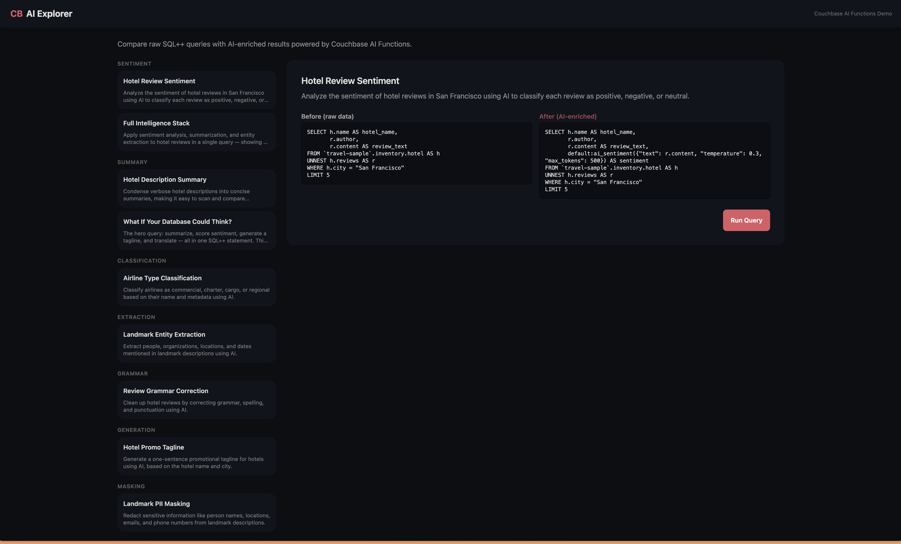

# CB AI Explorer

Interactive web app that demonstrates Couchbase AI Functions -- AI capabilities embedded directly in SQL++ queries. Select a query, hit Run, and see side-by-side results comparing raw data with AI-enriched output.




## AI Functions Demonstrated

| Function | What It Does |
|----------|-------------|
| Sentiment Analysis | Classify review text as positive / negative / neutral |
| Summarization | Condense verbose text into concise summaries |
| Classification | Categorize text into predefined labels |
| Entity Extraction | Identify people, locations, organizations, dates |
| Grammar Correction | Fix spelling, punctuation, and grammar |
| Text Generation | Create new content from prompts |
| PII Masking | Redact sensitive information |
| Similarity Scoring | Compare text pairs on a 0-1 scale |
| Translation | Convert text between languages |
| Completion | Custom AI responses with system/user prompts |
| Combo Intelligence | Multiple AI functions in a single query |

## Tech Stack

FastAPI, Jinja2, HTMX, Tailwind CSS + DaisyUI, Couchbase Python SDK

## Quick Start

### Prerequisites

- Python 3.8+
- A Couchbase Capella cluster with the `travel-sample` bucket loaded

### Couchbase Setup

1. In Capella, go to **AI Functions > Enable**, select all AI functions, and **Deploy**
2. Configure an AI model endpoint and credentials in the AI Functions settings
3. In **Query Workbench**, grant the external access role your AI functions need:

```sql
GRANT query_external_access TO your-username;
```

### App Setup

```bash
# Clone and enter the project
git clone <repo-url>
cd cb-ai-explorer

# Create a virtual environment and install dependencies
python -m venv .venv
source .venv/bin/activate
pip install -r requirements.txt

# Configure environment
cp .env.example .env
# Edit .env with your Couchbase connection details

# Run
uvicorn main:app --reload
```

Open [http://localhost:8000](http://localhost:8000).

### Environment Variables

| Variable | Required | Default | Description |
|----------|----------|---------|-------------|
| `CB_CONNECTION_STRING` | Yes | -- | Couchbase connection URI (e.g. `couchbases://cb.xxxxx.cloud.couchbase.com`) |
| `CB_USERNAME` | Yes | -- | Couchbase username |
| `CB_PASSWORD` | Yes | -- | Couchbase password |
| `CB_BUCKET` | No | `travel-sample` | Bucket name |

## Running Tests

```bash
pytest
```

Tests use mocked Couchbase connections -- no live cluster required.
